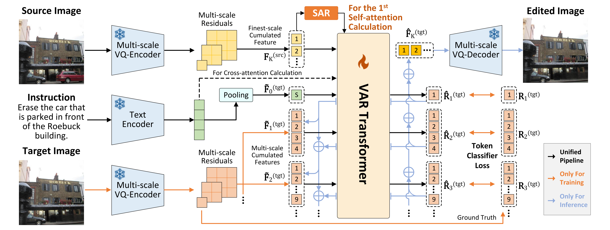

# VAREdit

This is the official repository of ICLR 2026 paper: [Visual Autoregressive Modeling for Instruction-Guided Image Editing](https://arxiv.org/abs/2508.15772) 


[VAREdit](https://github.com/HiDream-ai/VAREdit) is an advanced image editing model built on the [Infinity](https://huggingface.co/FoundationVision/infinity) models, designed for high-quality instruction-based image editing.

Try our online demos: [🤗VAREdit-8B-1024](https://huggingface.co/spaces/HiDream-ai/VAREdit-8B-1024) and [🤗VAREdit-8B-512](https://huggingface.co/spaces/HiDream-ai/VAREdit-8B-512).

## 🌟 Key Features

- **Strong Instruction Follow**: Follows instructions more accurately due to the autoregressive nature of the model.
- **Efficient Inference**: Optimized for fast generation with less than 1 seconds for 8B model.
- **Flexible Resolution**: Supports 512×512 and 1024×1024 image resolutions


## 📊 Model Variants

| Model Variant    | Resolutions  | HuggingFace Model                                                                 | Time (H800) | VRAM (GB) |
|------------------|--------------|----------------------------------------------------------------------------------|----------|-----------|
| VAREdit-8B-512   | 512×512      | [VAREdit-8B-512](https://huggingface.co/HiDream-ai/VAREdit)         |   ~0.7s   |   50.41     |
| VAREdit-8B-1024  | 1024×1024    | [VAREdit-8B-1024](https://huggingface.co/HiDream-ai/VAREdit)       |   ~1.99s   |   50.41     |

## 🚀 Quick Start

### Prerequisites

Before starting, ensure you have:
- Python 3.8+
- CUDA-compatible GPU with sufficient VRAM (8GB+ for 2B model, 24GB+ for 8B model)
- Required dependencies installed

### Installation

1. **Clone the repository**
```bash
git clone https://github.com/HiDream-ai/VAREdit.git
cd VAREdit
```

2. **Install dependencies**
```bash
pip install -r requirements.txt
pip install flash_attn
```

3. **Download model checkpoints**

Download the VAREdit model checkpoints:
```bash
# Download from HuggingFace
git lfs install
git clone https://huggingface.co/HiDream-ai/VAREdit
```

### Basic Usage

```python
from infer import load_model, generate_image

model_components = load_model(
    pretrain_root="HiDream-ai/VAREdit",
    model_path="HiDream-ai/VAREdit/8B-1024.pth",
    model_size="8B",
    image_size=1024
)

# Generate edited image
edited_image = generate_image(
    model_components,
    src_img_path="assets/test.jpg",
    instruction="Add glasses to this girl and change hair color to red",
    cfg=3.0,  # Classifier-free guidance scale
    tau=0.1,  # Temperature parameter
    seed=42  # Optional random seed
)
```

## 📝 Detailed Configuration

### Model Sampling Parameters

| Parameter | Description | Default |
|-----------|-------------|---------|
| `cfg` | Classifier-free guidance scale | 3.0 |
| `tau` | Temperature for sampling | 0.1 |
| `seed` | Random seed for reproducibility | -1 (random) |

## 📂 Project Structure

```
VAREdit/
├── infer.py              # Main inference script
├── train.py              # Main training script
├── trainer.py            # Main trainer script
├── infinity/             # Core model implementations
│   ├── models/          # Model architectures
│   ├── dataset/         # Data processing utilities
│   └── utils/           # Helper functions
├── tools/               # Additional tools and scripts
│   └── run_infinity.py  # Model execution utilities
├── assets/              # Demo images and resources
└── README.md           # This file
```

## 📊 Performance Benchmarks
| **Method** | **Size** | **EMU-Edit Bal.** | **PIE-Bench Bal.** | **Time (A800)** |
|:---|:---:|:---:|:---:|:---:|
| InstructPix2Pix | 1.1B | 2.923 | 4.034 | 3.5s |
| UltraEdit | 7.7B | 4.541 | 5.580 | 2.6s |
| OmniGen | 3.8B | 4.674 | 3.492 | 16.5s |
| AnySD | 2.9B | 3.129 | 3.326 | 3.4s |
| EditAR | 0.8B | 3.305 | 4.707 | 45.5s |
| ACE++ | 16.9B | 2.076 | 2.574 | 5.7s |
| ICEdit | 17.0B | 4.785 | 4.933 | 8.4s |
| **VAREdit** (256px) | 2.2B | 5.565 | 6.684 | 0.5s |
| **VAREdit** (512px) | 2.2B | 5.662 | 6.996 | 0.7s |
| **VAREdit** (512px) | 8.4B | 7.892 | 8.105 | 1.2s |
| **VAREdit** (1024px) | 8.4B | 7.379 | 7.688 | 3.9s |

**Note**: The released 8B models are trained longer and on more data.

## 📄 License

This project is licensed under the MIT License - see the [LICENSE](LICENSE) file for details.

## 📚 Citation

If you use VAREdit in your research, please cite:

```bibtex
@inproceedings{varedit2026,
  title={Visual Autoregressive Modeling for Instruction-Guided Image Editing},
  author={Mao, Qingyang and Cai, Qi and Li, Yehao and Pan, Yingwei and Cheng, Mingyue and Yao, Ting and Liu, Qi and Mei, Tao},
  booktitle={The Fourteenth International Conference on Learning Representations},
  year={2026}
}
```

## 🙏 Acknowledgments

- Built on the [Infinity](https://huggingface.co/FoundationVision/infinity) models

**Note**: This project is under active development. Features and code may change.
